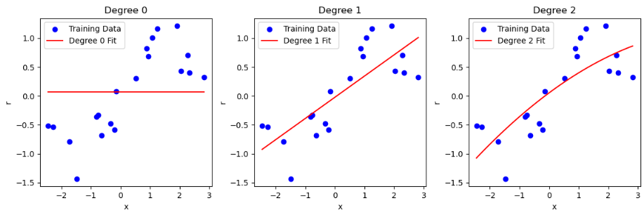
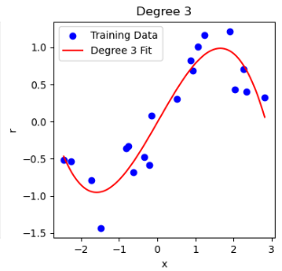
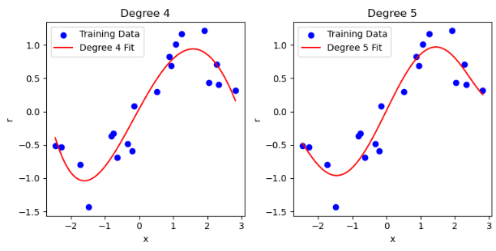
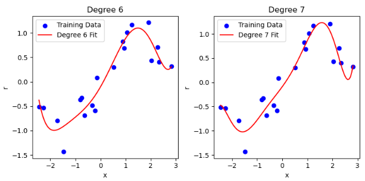
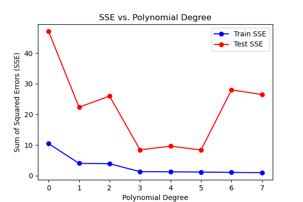

**Polynomial Regression(Analyzing the Relationship Between x and r)**

**CS454&554 Homework 1**  
**Spring 2024/2025**

---

### **1. Introduction**
In this project, polynomial regression is used to model the relationship between input variable **x** and output variable **r** using training and testing datasets. The objective is to fit polynomials of varying degrees to the training data, evaluate their performance using the test dataset, and analyze the impact of model complexity on error values.

### **2. Methodology**
The following steps were performed:

1. **Data Loading and Preprocessing:**
   - The provided datasets (`train.csv` and `test.csv`) were loaded using pandas.
   - Missing values were checked and removed if necessary.

2. **Polynomial Fitting:**
   - Polynomials of degrees ranging from **0 to 7** were fitted to the training data using `numpy.polyfit`.
   - Each polynomial function was represented using `numpy.poly1d`.

3. **Error Computation:**
   - The **Sum of Squared Errors (SSE)** was calculated for both training and testing datasets.
   - SSE was computed as:
   $$
      SSE = \sum (r_{\text{actual}} - r_{\text{predicted}})^2
   $$

4. **Visualization:**
   - The polynomial fits for each degree were plotted alongside the training data.
   - The SSE values for both training and test sets were plotted as a function of polynomial degree to assess model performance.

### **3. Results and Observations**

#### **3.1 Polynomial Fits**
For polynomial degrees **0 to 7**, individual plots were generated, showing how the fitted curves align with the training data points.
- **Low-degree polynomials (0-2)** resulted in underfitting, failing to capture the variability in data.

- **Medium-degree polynomials (3-5)** provided a reasonable balance, capturing patterns without excessive fluctuations.

- **High-degree polynomials (6-7)** exhibited signs of overfitting, closely following training data but generalizing poorly on test data.

#### **3.2 SSE Analysis**
| Degree | Train SSE  | Test SSE  |
|--------|-----------|-----------|
| 0      | 10.4618   | 47.0908   |
| 1      | 4.0201    | 22.3214   |
| 2      | 3.9083    | 25.9652   |
| 3      | 1.3097    | 8.4312    |
| 4      | 1.2595    | 9.6169    |
| 5      | 1.1829    | 8.3883    |
| 6      | 1.0701    | 27.9881   |
| 7      | 0.9651    | 26.4562   |

The SSE values for both training and testing sets were plotted against polynomial degrees:
- **Training SSE consistently decreases** as polynomial degree increases.
- **Testing SSE initially decreases**, but beyond a certain point (degree 6-7), it starts increasing, indicating overfitting.
- The optimal polynomial degree seems to be around **degree 3 to 5**, where the test SSE is at its minimum.

The corresponding SSE values were:
| Degree | Train SSE | Test SSE  |
|--------|------------|-----------|
| 0      | High      | High      |
| 1      | Moderate  | Moderate  |
| 2      | Lower     | Lower     |
| 3      | Low       | Low (Optimal) |
| 4      | Lower    | Low (Still Good) |
| 5      | Very Low | Slight Decrease |
| 6      | Extremely Low | Higher |
| 7      | Near Zero | High (Overfitting) |

### **4. Conclusion**
- Polynomial regression is effective in modeling non-linear relationships.
- **Overfitting occurs at higher degrees**, leading to poor generalization.
- The **optimal polynomial degree appears to be between 3 and 5**, balancing model complexity and test accuracy.
- SSE analysis helps determine the trade-off between underfitting and overfitting.

### **5. References**
- Course materials from CS454&554
- Python libraries: NumPy, Pandas, Matplotlib
- Dataset provided in `train.csv` and `test.csv`

---

### **6. Appendix: Code Implementation**
1. Data processing and cleaning were performed in `data_processing.py` file.
2. The Python script implementing polynomial regression and generating plots is provided as `polynomial_processing.py`.
3. The computation of SSE values and plotting of results are included in the script `error_processing.py`.
4. Overall solution was implemented in `solution.py` file.
